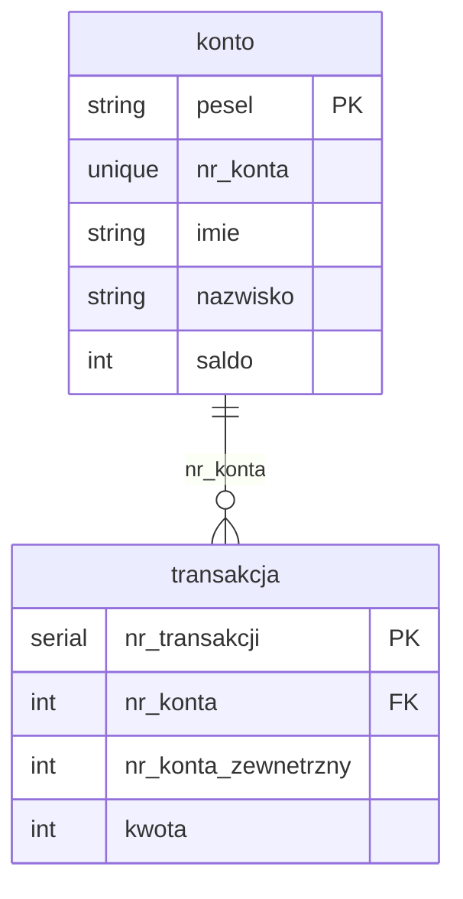

# DISTRIBUTED DATABASE

This is a repository to store a distributed database project.


## Database schema



## Example input

post /new_account/

```json
{
  "pesel": "string",
  "first_name": "string",
  "last_name": "string",
  "balance": 0,
  "password": "string"
}
```


post /new_transaction/
<!-- TODO: change args to REST standard -->

```json 
{
  "src_account": 0,
  "des_account": 0,
  "amount": 0
}
```

get /accounts/

```json
{
  "accounts": [
    1,
    2,
    3,
    5,
    2,
    3,
    4,
    5
  ]
}
```

get /account/account_id

```json
{
  "pesel": "135",
  "nr_konta": 1,
  "imie": "Ala",
  "nazwisko": "Makota",
  "saldo": 3123
}
```


get /transaction/account_id 
<!-- TODO: change to transactions -->

```json
{
  "pesel": "135",
  "nr_konta": 1,
  "imie": "Ala",
  "nazwisko": "Makota",
  "saldo": 3123
}
```