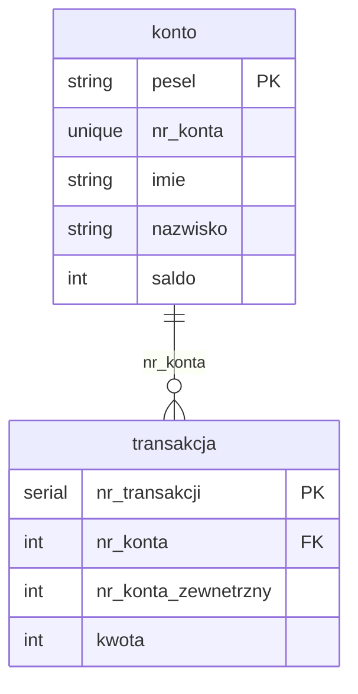

## Project Help
### To run the project on the first run:
------------------------------
Only once:
  <br><br>build the docker image
  ```shell
  make build
  ```
  Make sure to have docker installed and running and also free port 1433

### Then run in separate terminals:
------------------------------
  run the backend server
  ```shell
  make backend
  ```
  Make sure to have port 8000 free and the docker running

------------------------------
  run the frontend server
  ```shell
  make frontend
  ```
  Make sure to have port 8080 free 

------------------------------
  run the webpage
  ```shell
  make run
  ```
  Make sure to have chrome installed, or change the command to your browser

------------------------------


## Database schema



## API schema with example output
FastAPI docs is available on 127.0.0.1:8000/docs

post /new_account

```json
{
  "pesel": "string",
  "first_name": "string",
  "last_name": "string",
  "balance": 0,
  "password": "string"
}
```


post /new_transaction
```json 
{
  "src_account": 0,
  "des_account": 0,
  "amount": 0
}
```

get /login/account_id/password
```json
{
  "login": "success"
}
```

get /accounts

```json
{
  "accounts": [
    1,
    2,
    3,
    4,
    5,
  ]
}
```

get /account/account_id

```json
{
  "pesel": "135",
  "nr_konta": 1,
  "imie": "Ala",
  "nazwisko": "Makota",
  "saldo": 3123
}
```


get /transactions/account_id 

```json
[
  {
    "nr_transakcji": 1,
    "nr_konta": 1,
    "nr_konta_zewnetrzny": 4,
    "kwota": 40
  },
  {
    "nr_transakcji": 1,
    "nr_konta": 4,
    "nr_konta_zewnetrzny": 1,
    "kwota": -40
  } 
]
```