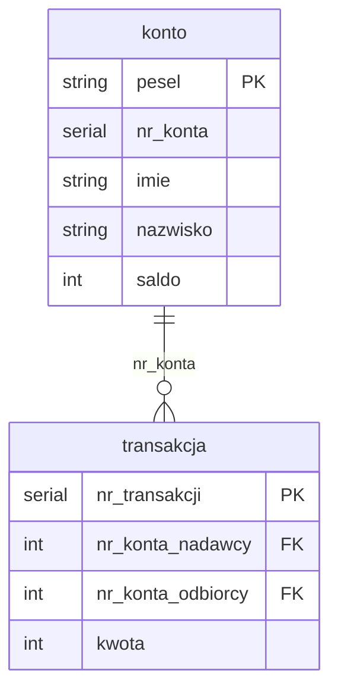

# DISTRIBUTED DATABASE

This is a repository to store a distributed database project.

## Database schema

```mermaid
erDiagram
    konto {
        string pesel PK
        serial nr_konta
        string imie
        string nazwisko
        int saldo
    }

    transakcja {
        serial nr_transakcji PK
        int nr_konta_nadawcy FK
        int nr_konta_odbiorcy FK
        int kwota
    }

    konto ||--o{ transakcja : "nr_konta"

```
